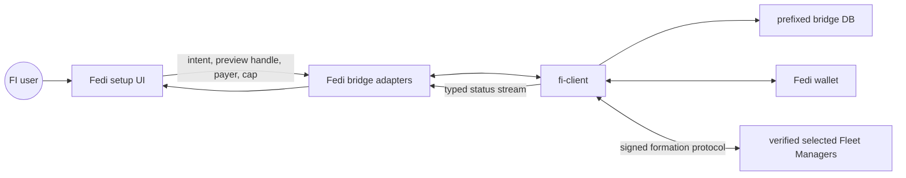
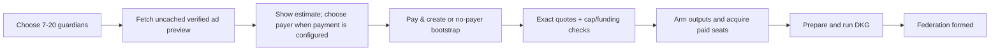

# Fedi app Federation Initiator integration

## Purpose and current scope

The Fedi app is the primary consumer of
[`fi-client`](../../crates/fi-client/specs/ARCH-fi-client.md). The bridge gives
the library an FI-scoped root, an isolated database namespace, an Iroh adapter,
and a typed RPC surface. The front end supplies formation intent,
presents the library's verified advertisement preview, selects one eligible
joined payer, and invokes Pay-and-create. `fi-client` owns the guardian set,
exact quotes, payment boundary, and formation transitions.

The formation contract includes registry discovery, automatic verified
operator selection, and wallet-backed payment RPCs. Fedi UI implementation is
owned separately. Post-formation management, liquidity, and fee arrangement
remain separate capabilities rather than app-side state machines.

## Ownership boundary

| Concern | Fedi owns | `fi-client` owns |
| --- | --- | --- |
| Identity | Derive and protect the FI-scoped root from the app root secret | Derive every FI protocol and backup key; construct and sign protocol digests |
| Storage | Allocate a dedicated encrypted bridge database prefix | Define and update formation recovery records |
| Payments | Project joined/balance state, prove exact quote aggregate plus fees/reserve is fundable without outputs, recover exact wallet operations, settle refunds | Authenticate admitted payers, verify quote terms, and enforce commercial and output boundaries |
| Transport | Bind and reuse an Iroh endpoint | Drive `FleetManagerService` and verify manager commitments against each locator |
| UI | Collect intent, render the uncached preview and eligible joined wallets, return the sealed handle/payer/cap | Verify all seats, select operators, validate input, resolve defaults, and own lifecycle transitions |

The bridge converts types and capabilities; it does not implement a second
formation state machine. The front end cannot mark registry data as trusted,
construct protocol transitions, or advance formation by submitting a synthetic
status.

## Intent collected by the app

The setup surface collects only the current `FormationIntent` fields:

- an optional federation display name;
- a federation size from the app's presets 7/10/13 (10 is the default and
  recommended preset) or custom inclusive range 7 through 20;
- the plan family, of which `InfiniteBestEffort` is currently the only one; and
- the canonical supported fedimintd version.

If the user leaves the name blank, `fi-client` generates a two-word name. The
resolved value is persisted and returned in active status, so the UI displays
one stable name across restart. The app does not collect per-seat DKG labels or
custom ceremony configuration.

## User flow

Preview is advertisement-only and valid for two minutes from completion of its
verified walk. Its sealed handle binds the exact request and canonical verifier
environment. The bridge keeps the
sealed, non-serializable approval behind an opaque transient handle; back-out,
restart, or re-entry discards it and refetches. No `GetQuote` is sent until the
Pay-and-create command supplies that handle, an explicit authenticated Ready
payer, and the original cap. A deployment with no setup-payment policy instead
uses the explicit no-payer bootstrap command with the same sealed handle. It
may seal an all-zero estimate with a zero limit and requests only free quotes:
a priced live offer returns typed
`PaymentFederationRequired` reauthorization before its quote or any wallet,
presentation, or output effect. Exact paid quotes are checked as one set and
paid automatically only within the cap.

Before wallet output generation, stale/drifted/over-cap terms, payer failure,
or selected-seat unavailability return a typed reauthorization error and
durable `Idle`. If a crash interrupts cleanup, resume recognizes the explicit
selected-flow record, exposes no second-authorization action before outputs,
and either
continues a still-live approval or completes cleanup. The same still-live approval may retry another payer; guardian
replacement always needs a fresh subset preview and authorization. Only an
exact rejected/refunded row is replaceable; accepted, paid, prepared, and
ambiguous siblings stay pinned. Sealing the replacement cap is the required
fresh replacement authorization, and exact replacement quotes auto-authorize
within it. If their checked total exceeds that cap, the post-output flow
publishes an exact `AuthorizePayments` action that the bridge must render and
submit before any replacement output starts. A definite FMan
connection failure is retried with bounded exponential backoff for up to two
minutes (clipped by the invocation deadline) before that result. Once outputs
are armed the operation is non-abandonable and transport failure stays on exact
replay rather than suggesting replacement; recovery continues after crash.

## Bridge API shape

The bridge exposes four concepts:

- current FI service health plus the typed `FiStatus`;
- an uncached verified preview command returning display DTOs plus an opaque
  two-minute handle;
- authenticated admitted payer IDs (including zero-balance wallets), a
  Pay-and-create command with an explicit payer, the no-payer all-zero
  bootstrap command, and the post-output
  `AuthorizePayments` command when a replacement quote subset exceeds its
  renewed cap; and
- a stream of typed status snapshots.

`FiStatus::Idle` means no active formation. An active formation always carries
its id and fully resolved persisted intent. The front end does not reconstruct
these values from nullable fields.

The active phase is one of `Preparing`, `AwaitingPaymentReadiness`,
`AcquiringSeats`, `PreparingDkg`, `DkgUnderway`, `PublishingSeatBindings`, or
`Formed`. Immediate command
failures and the snapshot's last operation error use stable typed categories;
UI behavior must not parse human-readable Rust error strings.

The ordinary `FedimintBridge` TypeScript wrapper owns stream identifiers and
cancellation, just like other bridge subscriptions. Components use that typed
wrapper rather than calling generated raw RPC names or managing stream ids
themselves.

## Payment adapter

For each verified paid aggregate, the Fedi wallet adapter:

1. reports which authenticated policy members are joined and Ready, while the
   admitted listing remains able to render a zero-balance refill choice;
2. constructs a deterministic aggregate reservation id from the formation and
   exact ordered quote plan, then first reconstructs any same-id durable wallet
   journal; a different plan under the same id fails closed;
3. only for a new journal, value-freely proves the complete verified locked
   issuance set is covered by balance after wallet fees and required reserve,
   then atomically records the hold before FI arms output generation;
4. carries the opaque aggregate capability into every exact member start and,
   under the wallet-wide spend guard, first recovers or atomically persists the
   deterministic quote-bound operation and its recovery metadata;
5. only after that exact operation is durable, atomically advances the member
   from `Held` to `Started` before releasing the spend guard or awaiting
   consensus. A crash between those checkpoints recovers the existing
   operation without another spend, while a crash after partial aggregate
   consumption reconstructs the journal without charging consumed members
   again; dropping the capability is not release;
6. returns only protocol payment evidence to `fi-client`; and
7. issues an opaque terminal-release proof only after consensus proves funding
   rejected or an FMan-signed refund settles. `fi-client` must present that
   proof before invalidating the member for replacement; Prepared or ambiguous
   payments fail closed.

The aggregate user cap and exact commercial authorization precede output
generation, but do not themselves make the flow irreversible. After same-terms
quote refresh, exact funding recheck, and FMan connection barriers, Manifold
durably projects `payment_outputs_started` immediately before polling the first
output call. A wallet operation never authorizes another quote.

Payment signatures, raw bearer ecash, refund secrets, and root-derived private
material do not enter FI storage, RPC status, analytics, or logs. The bridge can
be interrupted after a wallet or remote effect without losing correctness:
reopening the same wallet and FI database and resuming reconstructs the exact
operation.

## Progress and interruption

The status stream is independent of the command future driving the formation.
The UI subscribes when it needs live updates and can always query current
status after reconnecting. Dropping an app/RPC future stops local work but
cannot roll back a wallet transaction or remote request that already completed.
The next run resumes from durable state.

If a selected operation returns a reauthorization error before outputs, the
driver reconstructs and explicitly releases any wallet reservation before
wiping FI state to `Idle`; release ambiguity retains the formation for retry.
Only after the release-and-wipe transition succeeds does relaunch route to
preview/payer choice. If `payment_outputs_started` is true, resume is mandatory
and uses exact quote-bound wallet recovery.

Reloaded service-derived state is marked unsynced until FMan reconciliation.
The UI may display it as last known information but must not present it as a
fresh remote observation.

## Testing responsibilities

Bridge tests keep every library enum conversion exhaustive and verify the
database namespace and stable FI identity. RPC tests cover typed command errors,
idle and active status, and stream registration/cancellation. TypeScript tests
cover the normal `FedimintBridge` methods so application code never depends on
raw generated RPC details.

The app integration does not duplicate protocol E2E coverage. Manifold's
`defe` suite covers a seven-FMan free formation and a separate seven-FMan real
payment formation. Focused Manifold wallet tests cover recovery and refund
replay. Fedi-side tests focus on the consumer boundary,
including backgrounding or cancellation followed by status reload and resume.

## Deferred product work

- post-formation management;
- liquidity and fee-arrangement workflows; and
- product analytics for formation completion.

Each deferred capability should arrive first as a `fi-client` state or port
extension, followed by a thin bridge mapping and UI.
