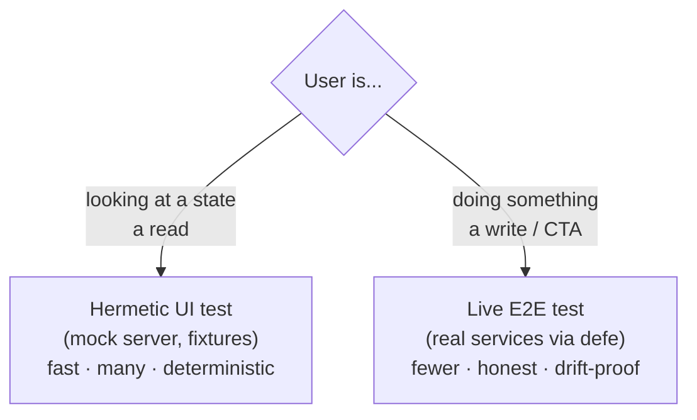
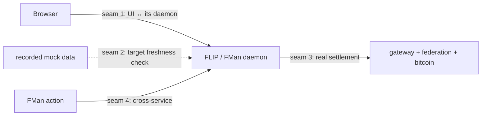

# Operator Dashboard E2E Testing Strategy (FLIP & FMan)

> Audience: anyone touching the FLIP or FMan dashboards. This explains *how we
> test the UIs and why*, in plain terms. The detailed build plan and the
> action-by-action test tables live in [`tasks/todo.md`](../../tasks/todo.md).

## The one-paragraph version

We test the dashboards two ways, for two different reasons:

1. **Hermetic UI tests** — fast, many, run against the mock server. They prove
   the screen handles each supplied fixture state. FLIP targets recorded
   backend-state breadth; FMan's hand-maintained fixtures are not exhaustive.
2. **Live E2E tests** — few, run against **real** services started by `defe`.
   They prove that *actions actually work* and that *the pieces really connect*.
   This is our honesty.

The intended end state records mock data from the real backend and checks it for
freshness. That recording/freshness gate is not implemented for FMan today:
its world and TypeScript vocabulary remain hand-maintained and can drift.

## What we're actually trying to prove

The goal is **confidence in the UI**, not re-checking the backend:

> For every inventoried state, does the UI show the right thing — and when a
> user does something, does it really happen and show the outcome?

Backend *correctness* ("did FLIP compute the right allocation?") is already
covered by the Rust test suites. The UI suite deliberately does not duplicate
that. Three suites, no overlap:

| Suite | Proves | Owner |
|---|---|---|
| Rust unit/integration | the backend computes the right answer | backend |
| **Hermetic UI tests** | the UI renders each supplied fixture state correctly | this doc |
| **Live E2E tests** | actions really work; the parts connect | this doc |

## The core idea: read vs write

Everything follows from one split — **is the user *looking* or *doing*?**



**Why writes must be live:** if you test a "Delete" button against a *canned*
success response, the button can be completely broken and the test still passes.
Only a real round-trip proves the click did something. And because a live test
reads back the daemon's *real, current* state, there's no fixture to drift — the
daemon is the source of truth in that moment. So the action tests are both the
ones that can't be fooled *and* the ones that can't fail on stale data.

**Why reads can be mocked:** rendering a state doesn't change anything, so canned
data lets us run dozens of cases quickly. Real-derived, freshness-checked
fixtures add backend coverage evidence; FMan's current fixtures do not.

## Tier 1 — Hermetic UI tests (the breadth)

- Run the UI against the **mock server** (already exists, already the default).
- FLIP targets data recorded from a real backend run. FMan's current mock is
  hand-maintained.
- Deterministic and repeatable; they run serially because the mock holds one
  shared state.

**Target coverage rule:** derive the finite status/variant list from the backend
and require one rendering test per value. FLIP is the proving ground for this
workflow. FMan's hand-maintained `packages/types` vocabulary is not an exhaustive
backend mirror, so its current hermetic suite proves only the cases it names.

> every value the backend can emit → one hermetic test that shows the UI handles it.

A new backend state with no UI test is then a *visible* gap, not a surprise in
production. (The inventory in `tasks/todo.md` already lists today's gaps — e.g.
FLIP health `warning`/`unhealthy` and several wallet-op statuses have no mock
scenario yet.)

## Tier 2 — Live E2E tests (the honesty)

- `defe` starts the **real** services as native processes (not Docker), hands us
  their address + token, and cleans them up afterwards.
- Used for **actions** and for the **seams** where systems meet.

### The evidence ladder

Because *all the real services are running*, we can check the strongest possible
proof that an action worked — often at the thing that was *affected*, not just at
FLIP's own screen. For each action, assert the **highest available rung**:

```
  strongest  1. the real affected component confirms it
                (query the real gateway / federation / bitcoin / other service)
             2. the dashboard's own UI shows the outcome
             3. an external side effect we can capture (file download, emitted token)
             4. an in-UI acknowledgment ("queued / accepted")
  weakest    5. a daemon log line
             ✗  nothing  → not a test
```

Rungs 4–5 are last resorts and a smell — if an action can *only* be proved by a
toast or a log line, that's flagged for the action's owner to emit something
better. (Today's flagged cases: FLIP "Retry funding step" and "Request
withdrawal" bottom out at an ack unless external services are present.)

### The seams (this is why the live set stays small)

The number of live tests tracks the number of **seams** (places two systems
meet), not the number of states. There are only a few:



- **Seam 1 — UI ↔ its own daemon:** the UI really talks to a real daemon (login,
  real request/response shapes). Cheap (bare daemon).
- **Seam 2 — recordings vs reality (freshness):** the target is to re-record
  from the live stack and diff against committed mocks. FMan does not currently
  implement this seam.
- **Seam 3 — action → real settlement:** the money path end to end. A small
  number of genuine journeys (needs gateway/federation/bitcoin).
- **Seam 4 — cross-service (FMan ↔ FLIP):** an action on one shows up on the
  other. One or two "they really talk" smoke tests — and only *after* FMan has
  its own harness.

## Keeping it honest

Tier 1 is only as truthful as its recordings are fresh (**Seam 2**). The target
is to re-record mock fixtures from the real backend on a schedule or in CI and
diff against what is committed. A difference would mean "the backend changed —
update the fixtures," caught in CI instead of production. Until that machinery
lands, FMan has no such guarantee: reviewers must treat its mocks and
hand-maintained type vocabulary as UI fixtures, not protocol evidence.

## How the two apps differ

| | FLIP | FMan |
|---|---|---|
| Playwright today | 9 specs + 1 `@live` tracer | 8 specs + 1 `@live` tracer |
| Backend admin API | real **HTTP** (`admin_http.rs`) | **Unix socket** (JSON-lines) for the CLI, plus a browser-facing HTTP adapter over the same dispatcher (`fleet-manager/src/admin_http.rs`) |
| Live E2E ready? | yes | yes — the adapter landed; the ceremony still needs an Initiator harness |
| Core multi-party flow | request → allocation | federation-setup ceremony — **the dashboard only observes it**; the Initiator drives it, so live ceremony tests need a separate signing harness |
| Error model | structured `{code, message}` | bare `{Err: string}` — assert on strings |

**Consequence:** FLIP is where we prove the whole pattern. Both apps now have a
live tier reaching a real daemon; what separates them is *provisioning depth* —
FMan's seat and wallet journeys need an Initiator-driven formation before there
is anything to act on. The action-by-action breakdown is in
[`tasks/live-e2e-rubric.md`](../../tasks/live-e2e-rubric.md).

## Where this runs

- **Local:** `just defe-serve` running in one shell; a small runner acquires a
  daemon and points Playwright at it.
- **CI:** the same runner wrapped in `defe exec`, sitting next to the existing
  `FLIP_E2E` / `FMAN_E2E` jobs.

`defe` is our own test-resource server: it allocates ports + a temp dir, spawns
the real service binary, health-checks it, and returns its address — then tears
it down when the run ends. No containers.

## Naming

- **Hermetic UI tests** = mock-backed, deterministic (industry: *hermetic e2e*).
- **Live E2E tests** = real services (industry: *full-stack / integration e2e*).
