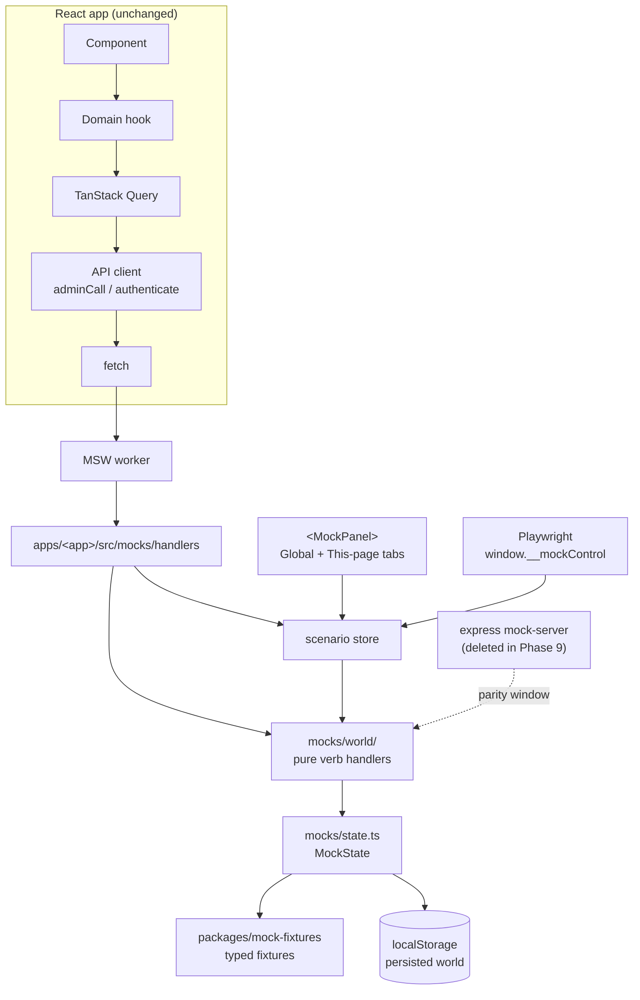

# Design: migrate the operator-ui mock servers to MSW

Status: proposed
Branch: `feat/msw-mock-migration` (cut from `feat/fman-dashboard`)
Date: 2026-08-08

## Objective

Replace the two Node/Express mock servers under `operator-ui/apps/*/mock-server/`
with [MSW](https://mswjs.io) running in the browser, so that mocked front-end
development needs one process (Vite) instead of two, while preserving every
existing scenario, endpoint contract, and Playwright behaviour.

Secondary goal, requested alongside the migration: a development mock panel with
**two tabs** — one filtered to the scenarios and verbs that affect the page you
are currently on, one showing the whole world.

Explicit non-goals: replacing TanStack Query, changing the API client, changing
any production behaviour, building a Chrome extension, or redesigning the
scenario model. Scenario names port **1:1**.

## 1. Current-state analysis

### 1.1 Shape

```
operator-ui/
├── apps/fleet-manager/            React SPA :5174 ─ vite proxy /api ───► fman-mock-server :8788
│   └── mock-server/               express, ~855 LOC, stateful, /__control panel (483-line HTML)
├── apps/liquidity-provider/       React SPA :5173 ─ vite proxy /admin ─► flip-mock-server :8787
│   └── mock-server/               express, ~1478 LOC, stateful, /__control panel (505-line HTML)
├── packages/mock-fixtures/        typed fixtures against @operator-ui/types — FLIP only
├── packages/types/                hand-maintained TS mirror of the Rust admin API
└── e2e/                           Playwright; mock target boots express + vite, workers: 1
```

### 1.2 Transport contracts — the two apps are not alike

**FMan is not REST.** One route, `POST /api/admin`, carrying an externally-tagged
`AdminRequest` body mirroring `crates/fman/core/src/admin.rs`:

- unit variant → a bare JSON string, `"ListSeats"`
- struct variant → a single-key object, `{"SeatStatus":{"seat_id":"…"}}`

Every response is `AdminResult<T>` = `{"Ok":…}` or `{"Err":"message"}`, always
HTTP 200. Dispatch is on the **body**, not the URL. Plus `POST /api/auth`
(password login, 204 + `Set-Cookie`, bare 401 on failure).

**FLIP is conventional.** `POST /admin/v1/:method` (24 methods), bearer auth,
plus an unauthenticated `GET /health` used by the SPA boot gate. Errors are a
`ServiceError` body with a matching HTTP status.

This asymmetry decides the handler shape: FMan gets **one** `http.post` handler
with an internal verb map; FLIP gets a handler per method (or one `:method`
handler, matching express).

### 1.3 Both mocks are stateful

They are not fixture lookups. Mutating verbs include:

| App | Verb | Mutation |
| --- | --- | --- |
| FMan | `DecommissionSeat` | flips `decommissioned`, rewrites `report` |
| FMan | `SetPrice` | writes `state.price` |
| FMan | `SetPayoutDestination` | writes `state.payoutDestination` |
| FMan | `CollectGuardianFees` | moves staged+idle → `collected_ecash_msat` |
| FMan | `SweepGuardianFees` | empties `collected_ecash_msat` |
| FMan | `OnboardAsNew` / `OnboardFromBackup` | flips `onboarded` |
| FLIP | `apply_setup_config` / `update_provider_config` | writes setup config + status |
| FLIP | `republish_advertisement` / `withdraw_advertisement` / `refresh_relays` | rewrites advertisement + relay states |
| FLIP | `request_withdrawal` / `create_deposit_address` | appends wallet operations |
| FLIP | `retry_funding_step` / `cancel_allocation` | rewrites allocation details |
| FLIP | `attestation_install` / `attestation_remove` | rewrites attestation list |

Any design that treats a scenario as a static fixture map is wrong for this
codebase.

### 1.4 Handler coupling

- **FMan handlers are already transport-agnostic**: `type Handler = (payload: unknown) => unknown`.
  No express types leak in. They can move to MSW essentially untouched.
- **FLIP handlers are express-coupled**: `(req: Request, res: Response) => void`,
  writing via `res.json(...)`. These need extraction to pure functions. This is
  the single largest chunk of real work in the migration.

### 1.5 Scenarios

| App | Count | Names |
| --- | --- | --- |
| FMan | 9 | `fresh-fleet`, `not-onboarded`, `awaiting-authorization`, `seats-empty`, `seats-mixed`, `seat-unavailable`, `wallet-not-receivable`, `offer-without-payments`, `earnings` |
| FLIP | 15 | `setup-fresh`, `setup-pending`, `all-clear`, `funds-critical`, `funds-warning`, `ad-stale`, `ad-withdrawn`, `ad-failed`, `ad-relays-mixed`, `health-degraded`, `wallet-ops-broadcast-cancelled`, `wallet-ops-review`, `allocations-action-required`, `allocations-cancelled`, `allocations-mixed` |

FMan carries a `notes` record (`desc` + `affects`) keyed off the builder map, so
adding an undocumented scenario is a type error. **FLIP has no notes at all.**

### 1.6 Fixtures

`packages/mock-fixtures` is typed against `@operator-ui/types` and consumed only
by the FLIP mock server. FMan's fixture data is inline in
`mock-server/src/scenarios.ts` with locally-defined `MockSeat`/`MockGuardianFees`
types.

### 1.7 React Query / API client

`@tanstack/react-query` with a bare `new QueryClient()`. The API client is a thin
`fetch` wrapper: `adminCall.ts`, `authenticate.ts`, `errors.ts` for FMan; the
equivalent under `apps/liquidity-provider/src/shared/api/`. **Nothing above
`fetch` changes in this migration.**

### 1.8 Playwright

- Config selects app via `E2E_APP` and target via `E2E_TARGET` (`mock` | `daemon`).
- Mock target boots express + Vite; **`workers: 1`** solely because the express
  server holds one shared world.
- Daemon target boots only Vite and proxies at a real daemon provisioned by the
  Rust runner via `defe`. `@live`-tagged specs run only in daemon mode.
- Scenario control: `resetScenario(request, name)` → `POST :878x/__control/scenario`.
  **69 call sites across 16 spec files**, of which **20+ switch scenario mid-test,
  after `page.goto`**.

### 1.9 Form inputs

There is **no form library** — no react-hook-form, formik, or `@tanstack/react-form`.
Forms are hand-rolled hooks over `useState` exposing `onXChange` callbacks
(`useOfferForm`, `useWithdrawForm`, `useSetupWizard`). Two consequences:

- Fields backed by an API already self-populate. `useOfferForm` seeds `priceSats`
  from `ShowPlans` on first load, so changing scenario already changes what the
  form starts with. Nothing to build there.
- Fields with **no** API source have their values hardcoded in e2e helpers:
  `e2e/support/wizard.ts::completeWizard` carries 10 literals across the seven
  FLIP wizard steps; `e2e/fman/setup.spec.ts` defines `PHRASE`;
  `e2e/fman/support/auth.ts` defaults to `'test-password'` — which is *also*
  hardcoded in the FMan scenario builders' `base()`. That duplication is the
  real defect worth fixing.

### 1.10 Migration risks identified

1. Daemon-mode dev servers (`E2E_TARGET=daemon`, `dev/fman-stack/up.sh`,
   `dev/flip-stack/up.sh`) run the *same* Vite dev server against a real backend.
   If MSW starts there it will hijack live traffic. **Highest-consequence detail
   in the migration.**
2. FMan's session is a module-level boolean in express, so it survives an SPA
   reload. Naively moved to browser memory, every refresh bounces the operator to
   the login page.
3. `mockServiceWorker.js` must exist in each app's `public/` and stay pinned to
   the installed msw version.
4. Requests fired before the worker is ready are unmocked; the worker must be
   awaited before `createRoot().render()`.
5. fman's Playwright readiness probe is `:8788/__control/scenarios`, which
   disappears.
6. FLIP scenario documentation does not exist and must be authored for the
   per-page tab to have anything to filter on.

## 2. Target architecture

The key move is **not** "rewrite express handlers as MSW handlers". It is:
extract the mock world into transport-agnostic code, point both transports at it
during the parity window, then delete express. Parity becomes structural rather
than eyeballed.



### 2.1 File structure

| Path | Contents | Status |
| --- | --- | --- |
| `packages/mock-devtools/src/scenario-store.ts` | store: get / set / reset / subscribe, localStorage persistence, versioning | new |
| `packages/mock-devtools/src/useScenario.ts` | `useSyncExternalStore` binding | new |
| `packages/mock-devtools/src/mock-panel/MockPanel.tsx` | two-tab panel, generic over a scenario catalog | new |
| `packages/mock-devtools/src/start.ts` | dev-only MSW boot helper | new |
| `packages/mock-devtools/src/types.ts` | `ScenarioCatalog`, `ScenarioNote`, `RouteKey` | new |
| `packages/mock-fixtures/src/fman/*` | FMan fixture builders lifted out of `scenarios.ts` | new subtree |
| `packages/mock-fixtures/src/flip/*` | existing fixtures, moved under a namespace | moved |
| `apps/<app>/src/mocks/browser.ts` | `setupWorker(...handlers)` | new |
| `apps/<app>/src/mocks/handlers.ts` | MSW handlers (FMan: one body-dispatch handler) | new |
| `apps/<app>/src/mocks/state.ts` | `MockState` + accessors | moved from mock-server |
| `apps/<app>/src/mocks/scenarios.ts` | named builders + notes | moved from mock-server |
| `apps/<app>/src/mocks/world/*` | transport-agnostic verb handlers | moved/extracted |
| `apps/<app>/src/mocks/routes.ts` | pathname → `RouteKey` map for the per-page tab | new |
| `apps/<app>/public/mockServiceWorker.js` | msw service worker | new (generated) |
| `apps/<app>/mock-server/**` | express | **deleted, Phase 9** |

`apps/<app>/src/mocks/` is the final home. During the parity window the express
server reaches back into it by relative path; that coupling dies with express.
The ESLint `boundaries` config gains a `mocks` layer importable only by `app`.

### 2.2 Why a shared `mock-devtools` package

Two apps need the same store, persistence, and panel (~300 LOC). Across app
boundaries a workspace package is the only shared home available under the
existing `boundaries` rules. Per-app code (state, scenarios, world, handlers)
stays per-app — only the generic machinery is lifted.

## 3. Scenario store and persistence

### 3.1 The whole mutated world persists

The persisted blob is the mutated `MockState`, not a set of control inputs. This
falls out cleanly because the control knobs are already fields on `MockState`
(`latencyMs`, `forcedErrors`, `authMode`/`password` for FMan, `phase`/`bootMode`
for FLIP), so there is no second "controls" object to reconcile.

```ts
// localStorage["operator-ui:dev:mocks:fman"]
{
  v: 1,                        // store schema version
  scenario: "seats-mixed",     // which builder produced the starting world
  world: { /* full MockState, including any mutations made this session */ }
}
```

Semantics:

| Action | Effect |
| --- | --- |
| Mutating verb succeeds | world is written back to localStorage |
| Page refresh | world rehydrates exactly as left — decommissioned seats stay decommissioned, withdrawn balances stay withdrawn |
| Scenario switch | discard persisted world, rebuild from the named builder, persist |
| Reset | discard, rebuild default scenario, persist |
| `v` mismatch or unknown scenario name | discard silently, rebuild default |

This is strictly closer to express behaviour than an in-memory world would be:
today a mutated world survives an SPA reload (server memory) but dies on server
restart. Under MSW it survives both.

### 3.2 Why localStorage and not IndexedDB

Measured, by serialising the actual FLIP scenario builders:

| Scenario | Serialized |
| --- | --- |
| `allocations-mixed` | 10.3 KiB (largest) |
| `all-clear` | 5.2 KiB |
| `wallet-ops-review` | 5.2 KiB |
| `setup-fresh` | 1.9 KiB |

FMan's worlds are smaller. Against localStorage's ~5 MiB ceiling that is roughly
500× headroom, so the capacity argument for IndexedDB does not apply here. What
decides it is API shape, and it cuts against IndexedDB twice:

- **MSW handlers read state synchronously.** A handler answering `ListSeats`
  needs the world immediately. With IndexedDB you would read once at boot and
  keep an in-memory copy regardless — paying the async cost without gaining
  anything, since the in-memory copy is what actually serves.
- **Playwright pre-seeding.** `addInitScript` seeding localStorage before
  navigation is one line. Seeding IndexedDB pre-navigation is an async
  open/upgrade/transaction dance inside an init script.

IndexedDB's genuine advantages — structured clone (preserving `Date`, `Map`,
`undefined`, binary) and non-blocking writes — do not apply: the state is plain
JSON-safe values, and a 10 KiB `JSON.stringify` on a user-initiated click is
sub-millisecond.

Persistence sits behind a three-function adapter (`load` / `save` / `clear`) in
`scenario-store.ts`, so if a future fixture set ever does grow large, swapping
the backend touches one file and no callers. That is the cheap hedge; building on
IndexedDB now is not.

### 3.3 When we write

Persisting on *every* dispatch would serialise the world on each poll — and the
apps do poll (`use-authorization-watch`, seat reports). Instead each verb is
declared read or mutating in the world module, and the store writes only after a
mutating verb. Explicit and greppable; no dirty-tracking magic.

### 3.4 Schema drift

The `v` stamp plus the scenario-name check is the whole guard. The persisted
world is **not** deep-validated — a schema library for dev-only mock state is
over-engineering, and the failure mode is mild (a broken dev session, fixed by
one click on Reset).

The trade this accepts: **changing the shape of `MockState` requires bumping
`STORE_VERSION`**, otherwise a colleague with a stale blob sees confusing
behaviour until they reset. This becomes a documented step in the "adding a
scenario / changing state shape" section of the developer docs (Phase 9).

### 3.5 FMan session

`sessionActive` moves from an express module-level variable into `MockState` and
persists with the world. This resolves risk 1.10.2 — refresh no longer logs the
operator out — and removes the one piece of mock state that lived outside the
state object.

MSW will still emit `Set-Cookie` on `POST /api/auth` for realism, but the
persisted flag is the source of truth. Documented as a deliberate divergence:
the browser cannot hold an HttpOnly cookie the way a real daemon sets one.

### 3.6 Multiple tabs

Last write wins. Two dev tabs on the same app will fight over the blob. Not worth
solving for a dev tool; noted in the docs.

## 4. The dev mock panel

```
┌─ Mock Controls ──────────────── [Global] [This page: Seats] ─┐
│                                                               │
│  THIS PAGE tab                    GLOBAL tab                  │
│  ─────────────                    ──────────                  │
│  scenarios whose `affects`        every scenario + desc        │
│    includes route "seats"         latency                      │
│  the verbs this page calls,       auth mode (FMan)             │
│    each with error injection      phase + bootMode (FLIP)      │
│  ● active scenario marked         all-verb error injection     │
│                                   [ Reset to default ]         │
└───────────────────────────────────────────────────────────────┘
```

- Mounts inside the router (it needs `useLocation`), dev-only, `React.lazy`.
- Replaces both `control-ui/index.html` panels (988 lines of hand-written HTML).
- The per-page tab needs structured route keys, so FMan's `affects: string`
  (prose: `'Overview, Seats, Wallet (all empty states), Offer'`) becomes
  `affects: RouteKey[]`. The existing `Record<ScenarioName, ScenarioNote>` typing
  keeps "undocumented scenario is a type error" intact.
- **All 15 FLIP scenarios need a `desc` + `affects` authored** — new content, not
  a mechanical port.

Route keys:

| App | Keys |
| --- | --- |
| FMan | `overview`, `seats`, `seat-detail`, `wallet`, `wallet-withdraw`, `offer`, `backup`, `backup-phrase`, `setup`, `auth` |
| FLIP | `overview`, `funds`, `allocations`, `advertisement`, `settings`, `setup`, `restore-console`, `auth` |

### 4.1 Switching scenario must refresh the screen

Changing scenario swaps the mock world underneath TanStack Query, which knows
nothing about it and keeps serving its cache. Observed in the browser after Plan
A: switching to `seats-mixed` while on the Seats page left the table showing the
previous scenario's rows until a manual reload.

Requiring a refresh is not acceptable for the panel's primary action, so the
scenario store must drive cache invalidation:

```text
mockStore.setScenario('seats-mixed')
        ↓  store notifies subscribers
queryClient.invalidateQueries()          ← app-side, in MockPanelMount
        ↓
active queries refetch → MSW serves the new world → screen updates in place
```

Two constraints on where this lives:

- **App-side, not in the package.** `packages/mock-devtools` must not import an
  app's `queryClient`; it has no business knowing the app uses TanStack Query at
  all. The mount component (`MockPanelMount`) owns the wiring.
- **Subscribe to the store, do not hook the button.** A button callback would
  miss `window.__mockControl.setScenario`, which is the path Playwright drives.
  Subscribing covers both, and as a side effect lets a mid-test scenario switch
  take effect without a navigation.

**Session handling — a deliberate divergence from Express.** Switching scenario
rebuilds the world, and `sessionActive` lives in the world (§3.5), so the switch
logs the operator out; invalidation then refetches into a 401 and bounces them to
the login screen. Express cleared the session too, but its control panel was a
separate page, so nobody met the friction. With an in-app panel this happens on
every switch. **The session should therefore be preserved across a scenario
switch**: it is an artifact of the mock's auth, not part of what state the fleet
is in. No e2e spec depends on the old behaviour — every spec sets its scenario
before navigating, in a fresh context that has no session either way.

## 5. Playwright

`resetScenario(request, name)` and the `/__control` HTTP surface both disappear.
The replacement keeps live mid-test switching, which 20+ specs rely on:

```ts
resetScenario(page, name)
  ├─ page not navigated (about:blank) → addInitScript seeds localStorage pre-boot
  └─ page already loaded             → page.evaluate(window.__mockControl.setScenario(name))
                                        (applies live, matching express semantics)
```

`window.__mockControl` is defined only by the mock bootstrap, so it is absent in
production builds and in daemon mode.

Changes required:

- `e2e/support/mock.ts` and `e2e/fman/support/mock.ts`: rewrite the helper.
- 69 call sites: mechanical `request` → `page`, plus `beforeEach` destructuring.
  Typecheck catches every miss.
- `playwright.config.ts`: drop both mock `webServer` express entries; fman's
  readiness probe becomes the Vite URL.
- Daemon `webServer` entries and `dev/{fman,flip}-stack/up.sh`: add
  `VITE_MOCKS=off`.

**Payoff:** `workers: 1` exists only because express holds one shared world. MSW
state is per browser context and Playwright gives each test a fresh context, so
mock-target runs can go parallel. Flipped in Phase 9 after verification, not
before.

Test isolation is preserved by construction: a fresh context has empty
localStorage, so persistence does not leak between tests.

## 6. Production safety

```ts
// apps/<app>/src/app/index.tsx
if (import.meta.env.DEV && import.meta.env.VITE_MOCKS !== 'off') {
  const { startMocks } = await import('@operator-ui/mock-devtools/start');
  await startMocks();          // must resolve before createRoot().render()
}
```

- Dynamic import behind a statically-analysable guard → Rollup drops the subtree
  from production bundles.
- `<MockPanel>` is `React.lazy` for the same reason.
- Verified by a build-time check wired into CI: after `pnpm build`,
  `grep -r "__mockControl\|seat-running-01" dist/` must return nothing.
- `onUnhandledRequest: 'warn'` — a missed endpoint should be loud, not silently
  bypassed.

## 7. Endpoint migration matrix

### FMan — `POST /api/admin`, dispatched on body

| Verb | Kind | Fixture source | Status |
| --- | --- | --- | --- |
| `ListSeats` | read | `mock-fixtures/fman/seats` | pending |
| `SeatStatus` | read | `mock-fixtures/fman/seats` | pending |
| `DecommissionSeat` | **mutating** | — | pending |
| `ReenrollTelemetry` | read (schedules) | — | pending |
| `ShowPlans` | read | derived from `state.price` | pending |
| `SetPrice` | **mutating** | — | pending |
| `ListPaymentFederations` | read | `mock-fixtures/fman/federations` | pending |
| `PayoutDestination` | read | `state.payoutDestination` | pending |
| `SetPayoutDestination` | **mutating** | — | pending |
| `SweepPaymentFees` | **mutating** | — | pending |
| `Withdraw` | **mutating** | — | retired in the daemon; mocked for the wallet screen only |
| `GuardianFees` | read | `mock-fixtures/fman/fees` | pending |
| `CollectGuardianFees` | **mutating** | — | pending |
| `SweepGuardianFees` | **mutating** | — | pending |
| `Onboarding` | read | `mock-fixtures/fman/onboarding` | pending |
| `RefreshHolderAuthorizations` | read (schedules) | — | pending |
| `ShowMnemonic` | read | constant | pending |
| `OnboardAsNew` | **mutating** | — | pending |
| `OnboardFromBackup` | **mutating** | — | pending |
| `POST /api/auth` | **mutating** (session) | — | pending |

This table is documentation, not the gate. The catalogue itself is checked
against the Rust request inventory in
`apps/fleet-manager/src/mocks/__tests__/verb-catalogue.test.ts`.

### FLIP — `POST /admin/v1/:method` + `GET /health`

Reads: `get_setup_state`, `get_provider_config`, `get_advertisement_state`,
`get_funds`, `get_health`, `list_wallet_operations`, `list_allocations`,
`get_allocation`, `attestation_list`, `inspect_backup`, `validate_setup`,
`create_backup`, `GET /health`.

Mutating: `apply_setup_config`, `update_provider_config`, `create_deposit_address`,
`request_withdrawal`, `republish_advertisement`, `withdraw_advertisement`,
`refresh_relays`, `retry_funding_step`, `cancel_allocation`, `attestation_install`,
`attestation_remove`, `restore_backup`.

All 24 methods plus `GET /health` migrate. The `?error=` query override and the
`DEFERRED_PHASE` gate port as-is.

## 8. Scenario matrix

Scenarios port 1:1 by name; the work is authoring `affects` for the per-page tab.

| App | Scenario | `affects` (to author/convert) |
| --- | --- | --- |
| FMan | `fresh-fleet` | overview, seats, wallet, offer |
| FMan | `not-onboarded` | setup |
| FMan | `awaiting-authorization` | setup, backup |
| FMan | `seats-empty` | seats, wallet |
| FMan | `seats-mixed` | seats, seat-detail, overview |
| FMan | `seat-unavailable` | seats, overview |
| FMan | `wallet-not-receivable` | wallet, overview |
| FMan | `offer-without-payments` | offer, overview |
| FMan | `earnings` | overview, wallet, seat-detail |
| FLIP | all 15 | **to be authored in Phase 6** |

## 9. Form fixtures

Scoped by what §1.9 found, not by a generic form-population design.

**Not in scope:** any field that already seeds from the API. `useOfferForm`
already reads `ShowPlans`; the withdraw form reads federation balances. Changing
scenario already changes those. Re-plumbing them would mean editing production
hooks to accept a dev-only seed, which the migration must not do.

**In scope:** the values that have no API source and are currently duplicated
between e2e helpers and the mock. They become typed fixtures in
`packages/mock-fixtures`, imported by both:

| Value | Currently hardcoded in | Also hardcoded in |
| --- | --- | --- |
| FLIP wizard config (10 fields across 7 steps) | `e2e/support/wizard.ts` | — |
| FLIP admin token `'e2e-token'` | `e2e/support/wizard.ts` | — |
| FMan recovery phrase | `e2e/fman/setup.spec.ts::PHRASE` | FMan `ShowMnemonic` handler |
| FMan password `'test-password'` | `e2e/fman/support/auth.ts` | FMan `scenarios.ts::base()` |

Two consumers, one source:

- **Playwright** imports them, replacing the literals in place. `completeWizard`
  keeps its accessible-selector approach; only the values move.
- **The dev panel** renders the ones relevant to the current route as
  click-to-copy chips on the This-page tab.

Click-to-copy rather than programmatic fill is deliberate: with no form library
there is no supported `reset(values)` API, and the alternatives are editing
production hooks or driving the DOM directly. Neither is worth it for a dev
affordance. If a form library is adopted later, the fixtures are already in the
right place to drive it.

One caveat carried over from `6996a68e` ("stop the wizard helper typing into a
daemon-owned field"): the advertised address is daemon-owned and must stay
disabled. Form fixtures cover operator-authored fields only.

## 10. Phased plan

Nothing is deleted until the phase that verified its replacement has passed.

| # | Work | Verified by |
| --- | --- | --- |
| 0 | This document; endpoint + scenario matrices | committed |
| 1 | Add `msw`, generate `mockServiceWorker.js` per app, boot in FMan, intercept **one** verb | that verb answers from MSW while express still runs |
| 2 | Move FMan world → `src/mocks/world/`; express imports it | `E2E_APP=fman` green, specs unchanged |
| 3 | `packages/mock-devtools`: store + localStorage persistence + Global tab | mutation survives refresh; scenario switch discards; reset works |
| 4 | FMan full cutover; swap fman e2e helper | `E2E_APP=fman` green with express **not running** |
| 5 | Extract FLIP `(req,res)` handlers → pure world fns | flip e2e green, express still serving |
| 6 | FLIP MSW handlers + scenario notes authored; swap flip e2e helper | flip e2e green with express not running |
| 7 | "This page" tab + route→key maps, both apps | manual pass over every route in both apps |
| 8 | Form fixtures per §9: lift the wizard/phrase/password literals into `packages/mock-fixtures`; e2e imports them; panel renders click-to-copy chips | e2e green with no behaviour change; no duplicated literals remain |
| 9 | Delete both express servers, `flip:be`/`fman:be` scripts, `express`/`tsx` deps, `/__control` vite proxies, `dev/menu/items.mjs` panel entry; docs; enable parallel workers; prod-bundle grep in CI | `selfci check`, full e2e both apps × both targets |

Phase 8 stays in this branch rather than splitting to a follow-up, consistent
with the decision to migrate both apps together.

## 11. Known behavioural differences from express

1. **HttpOnly cookie.** MSW emits `Set-Cookie` for realism, but a persisted
   `sessionActive` flag is the source of truth (§3.5). A browser cannot hold an
   HttpOnly cookie the way a real daemon sets one.
2. **State shape changes need a `STORE_VERSION` bump** (§3.4), otherwise a stale
   persisted world confuses the next developer until they hit Reset.
3. **Multiple tabs on one app fight over the blob** (§3.6).
4. **The `/__control` HTTP surface is gone.** Anything scripting the mock over
   HTTP must move to `window.__mockControl`. Known consumers: the two e2e
   helpers and `dev/menu/items.mjs`; both are handled in the plan.

## 12. Acceptance criteria

- [ ] Both apps run fully mocked with Vite alone; no express process required.
- [ ] All 15 FMan + 25 FLIP endpoints answer from MSW.
- [ ] All 9 FMan + 15 FLIP scenarios reproduce their express behaviour.
- [ ] Fixtures are typed against `@operator-ui/types`; no duplicated hand-written types.
- [ ] Form values with no API source live once in `packages/mock-fixtures`; no literal is duplicated between an e2e helper and a scenario builder.
- [ ] Mutated mock state survives a browser refresh via localStorage.
- [ ] Scenario switch and Reset both discard the persisted world correctly.
- [ ] A stale or version-mismatched blob falls back to the default scenario without a crash.
- [ ] Dev panel has both tabs; the per-page tab filters correctly on every route in both apps.
- [ ] Switching scenario updates the visible screen in place, with no manual reload, and does not log the operator out (§4.1).
- [ ] Playwright selects scenarios deterministically, including mid-test switches.
- [ ] Mock-target e2e passes with `workers > 1`.
- [ ] `E2E_TARGET=daemon` and both `dev/*-stack` scripts run with MSW disabled.
- [ ] Production bundles contain no mock code (CI-enforced grep).
- [ ] Express servers, scripts, and dependencies removed; README and dev docs updated.
- [ ] `selfci check` green.
