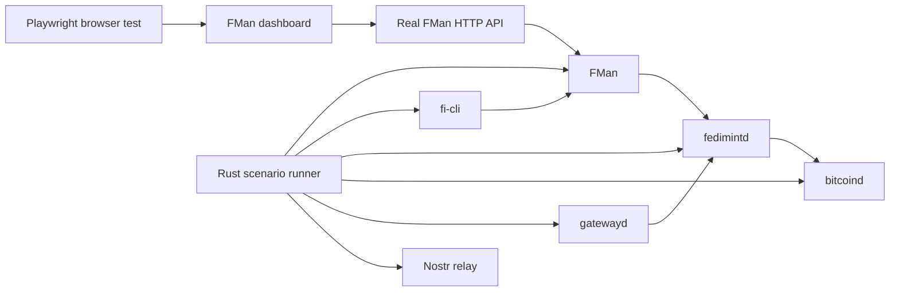
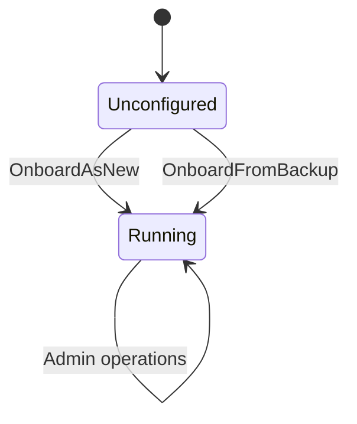

# FMan dashboard live end-to-end test plan

## Goal

Build a test system that proves that the dashboard works with the real Rust
FMan service.

The system will control these components:

- FMan
- `fedimintd`
- `fi-cli`
- `fedimint-cli`
- `bitcoind`
- `gatewayd`
- Nostr relay
- Browser

The system will test the main user journeys. It will also test important
failure states.

The Rust API will be the protocol source of truth. The mock will provide fast
and controlled state coverage.



## Status — reconciled 2026-08-14

This plan was written on 2026-08-12. Some of it has since landed, by a different
route: an underwriting review of the dashboard
(`reviews/underwriting/issues/README.md`) independently found several of the
faults this plan predicts, and the remediation
(`tasks/underwriting-remediation.md`) closed them. Read the phase list against
this table first.

| Phase | State | Evidence |
|---|---|---|
| 1.1 Fix the live test command | **Done 2026-08-14** | The recipe built `-p fleet-manager`, which matches **no package** — `fman` is the package, `fleet-manager` is only its `[[bin]]` name. `just test-e2e-ui-fman` could not build. Fixed in `justfile.custom.just`. |
| 1.2 Remove the old wallet contract | **Done** | `5dbd2090` deleted `Withdraw`, its hooks, page, route, types and mock verb. W1.1b (`22504127`) built the replacement `/payouts` screen on `PayoutDestination`, `SetPayoutDestination`, `SweepPaymentFees`, `CollectGuardianFees`, `SweepGuardianFees`. |
| 1.3 Enforce the Rust contract | **Done** | `AdminRequest` is now exactly the Rust-generated union with no hand-written member and no by-name test exclusion. Falsified from all four directions a fake verb can enter — client union, mirror, mock catalogue, generated file. |
| 3 Pre-onboarding HTTP patch | **Done 2026-08-14** | The packaging question was answered — Umbrel has no install-time user input, so the dashboard asks. One listener, bound once, handed to the fleet in place. The reword falsification was run on both sides of the fix. |
| 2 Scenario runner profiles | **Not done — now the critical path** | See Phase 2a. Absorbed W0.2 from the remediation plan. |
| 0a Prove the live specs ran | **Not done** | Absorbed W0.3. See Phase 0a. |
| 2, 4–8 | Not done | Unchanged. |

### One requirement this plan did not state, now added

Phase 1.3's exit conditions cover the mock's **verb list** but not its
**answers**. That gap was real: `Verb` was `(payload: unknown) => unknown`, so a
mock could answer any shape, and `GuardianFees` was in fact omitting a required
field the daemon always sends. Closed by `eb0f4052`, which types the mock against
the contract in both directions. Treat this as an added exit condition for 1.3:

- **A mock answer that does not satisfy its declared response type fails
  `tsc`**, and a mock that destructures a request field the contract does not
  declare fails too.

### Recommended order, and the confidence it buys

Judgement, not measurement. Current confidence that the dashboard does what an
operator needs in production: **~50%** — not because faults are known to remain,
but because every fix so far, including the new `/payouts` screen, is proven only
against a mock. That is the condition that produced three shipped, non-working
features.

| Step | Work | Confidence |
|---|---|---|
| A | Phase 3, pre-onboarding HTTP | ~60% — unblocks setup *and* every setup live test |
| B | Phase 2 + Phase 5 at the formed and paid profiles | **~85% — the step that moves the number most** |
| C | Constrain the admin bind address (below) | ~88% |
| D | Remaining convictions: #3 client half, #10's four unconverted sites, #11 | ~93% |
| E | Phase 7 failure injection, plus the three classes nobody has examined — accessibility, design-system conformance, adversarial security | ~95%, and no further without real operator use |

**A gates B, and A is not a code problem.** It is a packaging decision recorded
in two other places. Unblocking it is the highest-leverage action available.

### C — the admin listener's locality is assumed, never enforced

Not a live-test item, but it belongs here because the live tier is the first
thing that will exercise this surface in anger.

`REQ-no-public-ip` is a load-bearing constraint, and both auth modes in
`SPEC-operator-http` rest on it: trusted proxy is valid *"only when the listener
has no host port and an authenticating platform proxy is its sole network
peer"*, and password mode is for platform-routed LAN/Tor exposure.

Nothing enforces it. `admin_http_bind` (`crates/fman/bin/src/main.rs:127`) takes
any `SocketAddr`, with no loopback check anywhere. Bind `0.0.0.0` and it works
silently — at which point three individually-correct decisions become one live
risk: no rate limit on password attempts, no TLS *by design*
(`REQ-no-public-ip` forbids requiring a certificate), and password plus session
in cleartext.

Measured against the specs, the auth findings from the operations drill mostly
**satisfy** requirements — in-memory sessions are the specified lifetime, and a
`Secure` cookie flag would be *wrong*, since plain HTTP is the only transport the
requirement permits. The one real gap is that the assumption underneath them is
unenforced. `crates/liquidity-manager-daemon/claims/unauthenticated-admin-reaches-privileged-effect.md`
has the same question open for FLIP: *"Listener locality is not claimed...
requires owner disposition."* One decision closes both.

## Phase 0: Establish a clean baseline

Work from the current `origin/master`.

Do not build the new system on the old local branch. The local branch is behind
`origin/master`.

Actions:

1. Preserve the existing user changes.
2. Create a new `codex/` branch from current `origin/master`.
3. Run the current Rust, TypeScript, mock browser, and live browser tests.
4. Record the test durations.
5. Record all current failures and warnings.

Exit conditions:

- The branch contains no unrelated changes.
- Every baseline result is recorded.
- Existing user changes remain unchanged.

## Phase 1: Repair the existing confidence gates

### 1.1 Fix the live test command

Change the live recipe from:

```sh
cargo build -p fleet-manager
```

to:

```sh
cargo build -p fman
```

Add a CI check that runs the exact documented command.

### 1.2 Remove the old wallet contract

The UI must stop calling:

- `Withdraw`
- `WithdrawGuardianFees`

The UI must use the current Rust operations:

- `PayoutDestination`
- `SetPayoutDestination`
- `SweepPaymentFees`
- `SweepGuardianFees`

Update these areas together:

- TypeScript request types
- React hooks
- Wallet pages
- Mock verbs
- Browser tests
- Rust-generated fixtures

Remove the temporary contract exception for `Withdraw`.

### 1.3 Enforce the Rust contract

Use the existing Rust fixture generator from `origin/master`.

The gate must prove these facts:

- Every Rust `AdminRequest` has a generated request fixture.
- Every Rust response shape has a generated fixture.
- TypeScript accepts every generated fixture.
- The mock answers every current Rust verb.
- The mock answers no removed Rust verb.
- A Rust API change causes CI to fail until the UI contract is updated.

Exit conditions:

- No retired verbs remain.
- The mock verb list exactly matches Rust.
- The live command works without a manual correction.

## Phase 2: Build a reusable live scenario runner

Extend `fman-ui-e2e-runner`.

The runner will own the complete test environment. Playwright will own browser
actions and browser assertions.

The runner will support these named profiles:

```text
bare
formed
paid
recovery
restart
failure
```

### Bare profile

Start these components:

- One FMan
- One regtest `bitcoind`
- One Nostr relay

Use this profile for:

- Authentication
- Empty states
- Offer changes
- Payout destination changes
- Mnemonic display
- Authorization state
- FMan restart
- Session invalidation

### Formed profile

Start these components:

- Seven FMans
- Seven guardian `fedimintd` processes
- `fi-cli`
- `fedimint-cli`
- `bitcoind`
- Nostr relay

Reuse the formation logic in the existing Rust end-to-end test.

Use this profile for:

- Code-generated seat state
- DKG state
- Running seat state
- Invite code
- Federation join
- Seat health
- Decommission
- Guardian process restart

### Paid profile

Start the formed profile and add these components and states:

- A payment federation
- A funded FI wallet
- A real ecash seat payment
- `gatewayd`
- Mined regtest blocks

Use this profile for:

- Payment-federation balance
- Receivable status
- Seat-sale earnings
- Guardian-fee earnings
- Payment sweep
- Guardian-fee collection
- Guardian-fee sweep
- Real Lightning settlement

### Recovery profile

Start an FMan with no identity.

Publish controlled backup documents to the test relay.

Use this profile for:

- New onboarding
- Restore onboarding
- Zero-seat recovery
- Partly formed recovery
- Fully formed recovery
- Wrong mnemonic
- Lost response after commit
- Restart during recovery

## Phase 2a: Which profile first, and what each one proves

Absorbed from the remediation plan's W0.2 on 2026-08-14. The runner is 106 lines
today and stands up one bare profile; every `@live` spec stops at a read against
it. **This is now the critical path** — Phase 3 landed, so nothing else blocks
these.

Ordered cheapest-first, which is not the order Phase 2 lists them in:

| Profile | Stands up | Proves |
|---|---|---|
| **recovery** | one FMan with **no identity**, plus controlled backup documents on the test relay | the setup surface — new onboarding, restore, zero-seat recovery |
| **formed** | 7 FMans, 7 `fedimintd`, `fi-cli`, `fedimint-cli`, bitcoind, relay, driven through DKG | seat health — stop a guardian, assert the chip changes with no focus event |
| **paid** | formed **plus** a payment federation, funded FI wallet, a real ecash seat payment, `gatewayd`, mined blocks | the sweeps, and the lifetime earnings figure |

- **Recovery is newly possible and is the cheapest — do it first.** Until Phase 3
  landed, an FMan with no identity served no HTTP at all, so a browser test of
  onboarding could not be written. It needs one FMan, not seven.
- **Most of `formed` already exists.** `crates/tests-e2e/tests/fleet_manager_0_1_formation.rs`
  already drives DKG to formation in ~70 s. Lift its orchestration rather than
  rewriting it.
- **`paid` is the hard rung.** Budget several minutes; Phase 8 already puts
  formed and paid on nightly rather than per-PR.
- **Watch the arithmetic on the earnings assertion.** It wants *more than 20*
  remittances on one seat, and 21 genuine fee remittances is slow. Synthetic
  injection is likely right — but state plainly in the spec which figures were
  real and which were injected.

## Phase 0a: Prove the existing live specs have ever run

Absorbed from the remediation plan's W0.3.

`operator-ui/e2e/fman/live-writes.spec.ts` declares itself `UNVERIFIED AGAINST
LIVE` — written from static reads, never executed against a live stack. A spec
nobody has run is documentation, not a test. Phase 1.1 is the related warning:
the live recipe named a package that does not exist, so the documented entry
point could not build at all until 2026-08-14.

- Run every `@live` spec against a real stack; fix selectors and timing.
- Delete the disclaimer only when it is false.
- CI publishes a live-tier run with per-spec pass/fail.

## Phase 3: Add the required Rust HTTP patch

The current HTTP listener starts after onboarding. This prevents live browser
tests for setup and recovery.

Change FMan so that the authenticated HTTP listener starts before identity
creation.

The listener must remain active across both phases:



### Required behavior

While the host is unconfigured:

- `POST /api/auth` works.
- `OnboardAsNew` works.
- `OnboardFromBackup` works.
- All fleet-only requests return a clear error.
- The session remains valid after onboarding succeeds.

While the fleet is running:

- The same listener uses the normal fleet dispatcher.
- The same session cookie remains valid.
- Setup does not require a daemon restart.

### Design constraint

Do not add a production test-control API.

The Rust patch must support real product behavior. Test control must stay in the
runner.

Exit conditions:

- Playwright can complete real new onboarding.
- Playwright can complete real recovery.
- One session works across the phase change.
- Unix socket behavior remains unchanged.

## Phase 4: Add test-only scenario control

Add a loopback control service to the end-to-end runner.

This service must not be part of the FMan production binary.

Security rules:

- Bind only to `127.0.0.1`.
- Use a random token.
- Create the token for one test run.
- Do not log secrets.
- Shut down with the runner.

Example control operations:

- `publish_holder_authorization`
- `start_formation`
- `wait_for_seat_phase`
- `mine_blocks`
- `fund_payment_federation`
- `start_gateway`
- `stop_guardian`
- `restart_guardian`
- `restart_fman`
- `read_external_balance`
- `redeem_ecash_token`

Playwright can call these controls between browser actions.

Example journey:

```text
1. The browser opens the Seats page.
2. The runner starts FI formation.
3. The browser observes Code generated.
4. The runner advances DKG.
5. The browser observes DKG in progress.
6. The runner completes formation.
7. The browser observes Running.
8. fedimint-cli joins with the invite shown by the browser.
```

## Phase 5: Implement the journey matrix

### Authentication and startup

- The correct password signs in.
- A wrong password is rejected.
- A restart invalidates the old session.
- An unavailable daemon shows the correct error.
- The dashboard recovers when the daemon returns.

### Setup and recovery

- New FMan setup completes through the browser.
- A reload resumes the correct setup step.
- Recovery requires the permanent-offline acknowledgement.
- A valid phrase restores the correct counts.
- An invalid phrase shows a stable typed error.
- A lost response does not allow a second unsafe restore.
- A restart during setup preserves durable progress.

### Offer and authorization

- A price persists after reload.
- A zero price means free seats.
- A cleared price stops the offer.
- A Holder authorization published to the relay appears in the UI.
- A relay failure does not report a false authorization state.
- A newer FMan version displays the update warning.

### Seat lifecycle

- A new FI request creates a real seat.
- The UI shows each real phase.
- A running invite code works with `fedimint-cli`.
- A stopped guardian becomes unavailable.
- A restarted guardian becomes healthy.
- Decommission stops the guardian process.
- Decommission remains after FMan restart.
- Repeated decommission is safe.

### Wallet and payment

- A signed payment-federation publication is admitted.
- The federation becomes receivable.
- A real balance appears.
- A paid seat updates earnings.
- A removed member remains visible when it has funds.
- An unreadable balance shows unknown, not zero.
- A payout destination persists.
- A payment sweep settles through the real gateway.
- The UI shows the settled amount and operation ID.

### Guardian fees

- The UI shows configured guardian-fee policy.
- The UI detects a missing or changed guardian share.
- Real remittances appear.
- Collection moves available funds.
- Locked funds remain pending until the next cycle.
- A sweep reaches the configured payout destination.
- A restart preserves the fee history.

## Phase 6: Test the embedded release dashboard

Build FMan with the embedded operator UI.

Run Playwright directly against the FMan listener.

Do not use Vite or its proxy.

Test these conditions:

- `/` serves the dashboard.
- Hashed assets load.
- Direct SPA routes return the application.
- Missing `/api/*` paths do not return HTML.
- Authentication works.
- The cookie is same-origin.
- `/api/admin` works.
- Cache headers match the specification.
- Compressed assets load.
- No mock code exists in the production bundle.

This test covers the release package boundary.

## Phase 7: Add controlled failure tests

Use real process control when it is practical.

Use MSW for failures that are unsafe or expensive to reproduce.

### Real failures

- Stop `fedimintd`.
- Restart FMan.
- Stop the Nostr relay.
- Stop `gatewayd`.
- Make a payment federation non-receivable.
- Restart after a state change.
- Hold a guardian in DKG.

### Synthetic failures

- HTTP timeout
- Corrupt JSON
- Authentication expiry during submission
- Response lost before dispatch
- Response lost after commit
- High latency
- Each stable Rust error code

The test report must state if a failure is real or synthetic.

## Phase 8: Add CI levels

### Pull request checks

Run these tests:

- Rust contract fixture freshness
- TypeScript contract tests
- Unit and component tests
- All mock Playwright tests
- Bare live tests
- Embedded-dashboard smoke test

Target duration: less than 15 minutes.

### Nightly checks

Run these tests:

- Formed profile
- Paid profile
- Restart tests
- Failure tests
- Chromium, Firefox, and WebKit

### Release checks

Run these tests:

- Full journey matrix
- Embedded release binary
- Repeated runs
- Artifact capture
- No retries for one-time setup transitions

## Failure artifacts

Each failed live test must save these artifacts:

- Playwright trace
- Browser screenshot
- Browser console
- Network log
- FMan log
- `fedimintd` logs
- `gatewayd` log
- Nostr relay log
- Scenario event log
- Sanitized state summary

Never save these secrets:

- Mnemonics
- Session cookies
- Gateway passwords
- Bearer ecash
- Telemetry capabilities

## Delivery sequence

Implement the work in these patches:

1. Repair the contract and command.
2. Move the wallet to the current Rust API.
3. Add pre-onboarding HTTP support.
4. Add the reusable FMan formation harness.
5. Add bare and formed browser journeys.
6. Add paid and gateway journeys.
7. Add the embedded release-dashboard test.
8. Add failure injection and CI schedules.

## Final acceptance rule

The dashboard is ready when all these statements are true:

- Every current Rust request has a UI contract test.
- Every finite response state has a rendering test.
- Every user write has at least one real live round trip.
- Important writes have an external service assertion.
- Setup, recovery, restart, formation, and payment work through the browser.
- The embedded release dashboard passes.
- No mock-only success path exists for a removed Rust operation.

This plan provides strong release confidence. No test system can provide
absolute certainty. This system will provide direct evidence at each important
boundary.

## Live interaction test rubric

### Coverage rule

The live suite must touch every control that a release dashboard presents.

Controls include:

- Buttons
- Links
- Form fields
- Checkboxes
- Copy controls
- Navigation items
- Automatic transitions that replace a manual action
- Retry controls

Each interaction must have an entry in a checked interaction manifest. Each
manifest entry must name a live Playwright test.

The manifest can use this shape:

```ts
export const fmanInteractionManifest = {
  'auth.submit': 'AUTH-002',
  'boot.retry': 'BOOT-003',
  'setup.start-new': 'SETUP-002',
  'offer.save': 'OFFER-003',
  'seat.copy-invite': 'SEAT-007'
} as const;
```

A small source check must find interactive elements and compare them with this
manifest. A reviewer must add a manifest entry when a new interaction is added.
CI must fail when an entry has no live test.

The suite must not approve an interaction that the Rust API does not support.
The old `Withdraw` and `WithdrawGuardianFees` interactions must be removed
before the wallet live tests can pass.

### Evidence levels

Each test must state its evidence level.

| Level | Required evidence |
|---|---|
| E0 | The embedded release dashboard loads and the browser can use the control. |
| E1 | The control reads a response from the real FMan process. |
| E2 | A write is read back from the real FMan after reload or restart. |
| E3 | An affected external component confirms the result. |

Rules:

- A read interaction needs E1 or higher.
- A write interaction needs E2 or higher.
- A cross-service or money interaction needs E3.
- A client validation interaction can use E0. It must also prove that no request
  reached FMan.
- A copy interaction must verify the exact clipboard value.
- A secret interaction must also prove that the secret did not enter browser
  storage, the URL, browser logs, or test artifacts.

### Test isolation

Every irreversible test must use a fresh harness world.

This rule applies to:

- New onboarding
- Recovery
- Formation
- Decommission
- Payment
- Guardian-fee collection
- Revenue sweep

Read-only tests can share a prepared world. Mutating tests must not depend on
test order.

### Launch, authentication, and application shell

| ID | Profile | Interaction | Live assertion | Evidence |
|---|---|---|---|---|
| LAUNCH-001 | `unconfigured` | Open `/` from the embedded FMan binary. | The public application shell and hashed assets load before sign-in. No Vite server is running. | E0 |
| LAUNCH-002 | `bare` | Open each SPA route directly. | `/`, `/authorization`, `/seats`, `/wallet`, `/offer`, `/backup`, and `/backup/phrase` load through the embedded router. | E0 |
| LAUNCH-003 | `bare` | Request an unknown application path and unknown API path. | An application path falls back to the SPA. An unknown `/api/*` path does not return HTML. | E0 |
| AUTH-001 | `bare` | Enter a wrong password and select **Sign in**. | The real `/api/auth` returns 401. The page keeps the operator on the sign-in screen. | E1 |
| AUTH-002 | `bare` | Enter the correct password and select **Sign in**. | FMan creates a session. The browser reaches the requested dashboard route. | E1 |
| AUTH-003 | `bare` | Submit the sign-in form with an empty value. | The browser does not send an authentication request. | E0 |
| AUTH-004 | `bare` | Restart FMan after sign-in. | The old cookie is rejected. The sign-in screen replaces all privileged content. | E1 |
| BOOT-001 | `bare` | Stop FMan while the dashboard is open. | The dashboard shows the daemon error screen. It does not show stale privileged data. | E1 |
| BOOT-002 | `bare` | Start FMan again without selecting **Retry**. | Automatic polling recovers and shows the correct gate. | E1 |
| BOOT-003 | `bare` | Stop FMan, start it, and select **Retry**. | The retry starts a real `Onboarding` request and restores the correct screen. | E1 |
| NAV-001 | `bare` | Select each sidebar item. | **Overview**, **Authorization**, **Seats**, **Wallet**, and **Backup** open the correct route and display real FMan data. | E1 |
| NAV-002 | `bare` | Reload each selected route. | The selected route and authentication state remain correct. | E1 |

### New-fleet setup

These tests require the pre-onboarding HTTP patch. Each test uses a fresh
`unconfigured` profile.

| ID | Profile | Interaction | Live assertion | Evidence |
|---|---|---|---|---|
| SETUP-001 | `unconfigured` | Sign in to a host with no identity. | The setup choice screen appears. The dashboard navigation does not appear. | E1 |
| SETUP-002 | `unconfigured` | Select **Start a new fleet**. | The real `OnboardAsNew` request creates the identity once. The phrase step appears without a process restart. | E2 |
| SETUP-003 | `unconfigured` | Select **Reveal phrase**. | The phrase comes from real FMan only after the selection. It is a valid 12-word phrase. | E1 |
| SETUP-004 | `unconfigured` | Try **I've written it down — continue** before and after reveal. | The control is disabled before reveal. It advances only after a successful real phrase read. | E1 |
| SETUP-005 | `unconfigured` | Select **Copy the authorization request**. | The clipboard contains the exact request built from the FMan Nostr public key. The credential SDK parses it. | E3 |
| SETUP-006 | `unconfigured` | Publish an authorization through the harness. | The setup page observes the signed relay event and enables **Continue now**. | E3 |
| SETUP-007 | `unconfigured` | Select **Continue now** after authorization. | The wizard advances once. The delayed automatic transition cannot advance it twice. | E1 |
| SETUP-008 | `unconfigured` | Do not select **Continue now** after authorization. | The delayed automatic transition advances to price once. | E1 |
| SETUP-009 | `unconfigured` | Select **Skip for now** before authorization. | The wizard advances to price. FMan still reports that no authorization was observed. | E2 |
| SETUP-010 | `unconfigured` | Enter a price and select **Finish setup**. | The overview shows the saved real price. Reload and FMan restart retain it. | E2 |
| SETUP-011 | `unconfigured` | Leave price empty and select **Finish setup**. | FMan stores no offer. The overview shows that the fleet is not selling seats. | E2 |
| SETUP-012 | `unconfigured` | Enter an invalid price and submit. | The browser shows validation. The harness confirms that `SetPrice` was not called. | E0 |
| SETUP-013 | `unconfigured` | Reload at each setup step. | The dashboard resumes from durable FMan state. It never makes the operator repeat an irreversible action. | E2 |

### Recovery setup

Each recovery test uses a fresh `recovery` profile.

| ID | Profile | Interaction | Live assertion | Evidence |
|---|---|---|---|---|
| RECOVERY-001 | `recovery` | Select **Recover from a phrase**. | The recovery form appears. The new-fleet operation is not called. | E1 |
| RECOVERY-002 | `recovery` | Enter a phrase without selecting the confirmation checkbox. | **Recover this fleet** stays disabled. FMan receives no restore request. | E0 |
| RECOVERY-003 | `recovery` | Select and clear the permanent-offline checkbox. | Submission becomes enabled and disabled as expected. FMan receives no request until submit. | E0 |
| RECOVERY-004 | `recovery` | Select **Back** from the form. | The setup choices return. No identity is installed. The phrase is removed from the page. | E1 |
| RECOVERY-005 | `recovery` | Submit an invalid phrase. | Real FMan returns the typed refusal. **Try again** returns to an empty form. | E1 |
| RECOVERY-006 | `recovery` | After a refusal, select **Back to setup options**. | The setup choices return. FMan still has no identity. | E1 |
| RECOVERY-007 | `recovery` | Restore a phrase with no backup records and select **Continue**. | FMan installs the identity. The UI shows zero recovered seats and then advances. | E2 |
| RECOVERY-008 | `recovery` | Restore a phrase with formed seats and select **Continue**. | The shown seat and formed counts match relay documents. The recovered seats later appear in the dashboard. | E3 |
| RECOVERY-009 | `recovery` | Lose the HTTP response after FMan commits the restore. Then select **Check status**. | The UI does not offer a second restore. The status check confirms the installed identity. | E2 |
| RECOVERY-010 | `recovery` | After the committed restore is confirmed, select **Continue**. | The wizard advances without repeating recovery. | E2 |
| RECOVERY-011 | `recovery` | Lose the HTTP request before dispatch. Then select **Check status**. | FMan reports no identity. The UI returns to the recovery form. | E1 |
| RECOVERY-012 | `recovery` | Expire authentication during restore submission. | The sign-in gate opens. The phrase is not retained in the rendered page or browser storage. | E1 |
| RECOVERY-013 | `recovery` | Restart FMan during recovery. | The next page state follows durable FMan state. It never assumes success from browser state. | E2 |

### Overview and offer

| ID | Profile | Interaction | Live assertion | Evidence |
|---|---|---|---|---|
| OVERVIEW-001 | `bare` | Open Overview on a fresh fleet. | Balance, earnings, seat sales, guardian fees, offer, and attention data come from real FMan reads. | E1 |
| OVERVIEW-002 | `bare` | Select **Change price**. | The offer page opens with the real stored price. | E1 |
| OVERVIEW-003 | `bare` | Select the authorization **Review** link. | The Authorization page opens and starts a real relay reconciliation. | E1 |
| OVERVIEW-004 | `paid` | Make the accepted payment federation non-receivable. Select its **Review** link. | The Wallet page opens and shows the same real federation as not receiving. | E2 |
| OVERVIEW-005 | `bare` | Set a paid offer with no receivable payment federation. Select **Review**. | The Offer page opens with the same persisted price. | E2 |
| OVERVIEW-006 | `paid` | Complete a real paid seat sale. | Seat-sale earnings match the accepted payment claim recorded by FMan. | E3 |
| OVERVIEW-007 | `paid` | Complete a real guardian-fee remittance. | Guardian-fee earnings match the federation remittance data. | E3 |
| OFFER-001 | `bare` | Change the field and select **Cancel**. | Overview opens. The original price remains after reload. | E2 |
| OFFER-002 | `bare` | Enter a positive whole-sat price and select **Save**. | Overview shows it. Reload and FMan restart retain it. | E2 |
| OFFER-003 | `bare` | Enter `0` and select **Save**. | FMan retains an advertised free offer. | E2 |
| OFFER-004 | `bare` | Clear the field and select **Save**. | FMan retains no offer. | E2 |
| OFFER-005 | `bare` | Enter fractional, negative, and invalid text values. | The browser shows validation and sends no write. | E0 |
| OFFER-006 | `bare` | Expire authentication before **Save**. | The sign-in gate opens. After sign-in, a fresh read shows that the price did not change. | E2 |

### Authorization

| ID | Profile | Interaction | Live assertion | Evidence |
|---|---|---|---|---|
| AUTHORIZATION-001 | `bare` | Open Authorization. | The page sends `RefreshHolderAuthorizations` and reads `Onboarding` from real FMan. | E1 |
| AUTHORIZATION-002 | `bare` | Select **Copy the authorization request**. | The clipboard value matches the QR payload and the real FMan Nostr public key. | E1 |
| AUTHORIZATION-003 | `bare` | Scan or decode the QR through the credential SDK test adapter. | The SDK accepts the payload and produces an authorization that FMan accepts from the relay. | E3 |
| AUTHORIZATION-004 | `bare` | Publish one valid Holder authorization. | The page changes to observed state and shows the exact Holder public key. | E3 |
| AUTHORIZATION-005 | `bare` | Stop the relay and reopen Authorization. | The page keeps the last accepted authorization and shows the refresh failure. | E3 |

### Seats and seat detail

| ID | Profile | Interaction | Live assertion | Evidence |
|---|---|---|---|---|
| SEAT-001 | `bare` | Select the offer link in the empty Seats message. | It opens `/offer`. This test rejects the current stale `/plans` target. | E0 |
| SEAT-002 | `formed` | Start FI formation while the Seats page is open. | Polling shows the real seat without a reload. | E1 |
| SEAT-003 | `formed` | Observe the seat through code-generated, DKG, and running phases. | Each displayed phase matches the FMan `SeatStatus` response at that time. | E3 |
| SEAT-004 | `formed` | Select **Copy seat ID**. | The clipboard value matches the seat created by the FI harness. | E3 |
| SEAT-005 | `formed` | Select **Copy FI ID** in the table. | The clipboard value matches the active `fi-cli` identity. | E3 |
| SEAT-006 | `formed` | Select the seat identifier link. | The correct seat detail route opens and reads the same real seat. | E1 |
| SEAT-007 | `formed` | Select **Copy guardian code** during code-generated state. | The clipboard value matches the code consumed by the FI formation process. | E3 |
| SEAT-008 | `formed` | Select **Copy invite code** after formation. | `fedimint-cli` joins the federation with the exact clipboard value. | E3 |
| SEAT-009 | `formed` | Select **Copy FI ID** on seat detail. | The clipboard value matches the FI harness identity. | E3 |
| SEAT-010 | `formed` | Select **Back to seats**. | The list opens and still contains the same seat. | E1 |
| SEAT-011 | `formed` | Stop one guardian child. | Polling changes the seat to unavailable. Restarting the child returns it to healthy. | E3 |
| SEAT-012 | `formed` | Use the planned **Decommission seat** action and confirm it. | FMan records the terminal state. The guardian ports close. Reload and FMan restart retain the state. | E3 |
| SEAT-013 | `formed` | Repeat the decommission action through the API guard. | FMan reports `already_decommissioned`. The UI does not present an unsafe repeat control. | E2 |
| SEAT-014 | `formed` | Open seats with each real completion callback state prepared by the harness. | Pending, blocked, delivered, and terminal callback states match the daemon record. | E1 |

### Wallet, payout, and payment federation

The current wallet withdrawal interaction calls a removed Rust verb. It must be
replaced before this group can pass.

| ID | Profile | Interaction | Live assertion | Evidence |
|---|---|---|---|---|
| WALLET-001 | `bare` | Open Wallet with no accepted payment federation. | The real empty state appears. No add or remove control appears. | E1 |
| WALLET-002 | `paid` | Publish an accepted payment federation. | The row appears after FMan admits and joins the signed publication. | E3 |
| WALLET-003 | `paid` | Select **Copy federation ID**. | The clipboard value matches the federation used by `fedimint-cli` and `gatewayd`. | E3 |
| WALLET-004 | `paid` | Fund the payment federation and mine the required blocks. | The real balance updates without a false zero during loading. | E3 |
| WALLET-005 | `paid` | Remove the federation from the accepted publication while funds remain. | The row remains as a former member and keeps its real balance. | E3 |
| WALLET-006 | `paid` | Make the wallet balance read fail. | The UI shows an unknown balance. It does not show zero or enable a money action. | E1 |
| WALLET-007 | `paid` | Open the planned payout destination editor. Enter a valid destination and save. | FMan reads back the destination after reload and restart. | E2 |
| WALLET-008 | `paid` | Clear the payout destination and save. | FMan reads back `null`. Sweep controls explain that a destination is required. | E2 |
| WALLET-009 | `paid` | Cancel a payout destination change. | The stored destination does not change. | E2 |
| WALLET-010 | `paid` | Select the planned payment **Sweep** action. | `SweepPaymentFees` settles through real `gatewayd`. The recipient or gateway confirms the amount and operation. | E3 |
| WALLET-011 | `paid` | Repeat payment sweep with no economical balance. | FMan refuses the operation. The UI keeps the previous settled record and shows the error. | E2 |
| WALLET-012 | `paid` | Stop `gatewayd` and select payment **Sweep**. | The UI shows the real settlement failure. The payment-federation balance remains. | E3 |
| WALLET-013 | `paid` | Inspect the release UI for the retired action. | No `Withdraw` token action or route exists. The mock also does not answer `Withdraw`. | E0 |

### Guardian-fee actions

These interactions must be added to the dashboard before the related Rust
operations can have full live UI coverage.

| ID | Profile | Interaction | Live assertion | Evidence |
|---|---|---|---|---|
| FEES-001 | `paid` | Open guardian-fee details for a running seat. | Policy, account, staged, locked, idle, collected, and remittance values match real federation data. | E3 |
| FEES-002 | `paid` | Select **Collect guardian fees**. | `CollectGuardianFees` moves staged and idle funds. Locked funds remain pending until the next cycle. | E3 |
| FEES-003 | `paid` | Advance the federation cycle and collect again. | Previously locked funds become collectable and move to ordinary ecash. | E3 |
| FEES-004 | `paid` | Select **Sweep guardian fees**. | `SweepGuardianFees` settles through real `gatewayd` to the configured payout destination. | E3 |
| FEES-005 | `paid` | Stop `gatewayd` and select **Sweep guardian fees**. | The sweep fails without losing collected ecash. | E3 |
| FEES-006 | `paid` | Change the guardian-fee recipient metadata. | The UI reports the missing or changed FMan share from the real consensus metadata. | E3 |
| FEES-007 | `paid` | Restart FMan after collection and remittance. | Fee balances and remittance history remain correct. | E2 |

### Backup and copy controls

| ID | Profile | Interaction | Live assertion | Evidence |
|---|---|---|---|---|
| BACKUP-001 | `bare` | Select **Copy service pubkey**. | The clipboard value matches FMan identity derivation. | E1 |
| BACKUP-002 | `bare` | Select **Copy service Nostr pubkey**. | The clipboard value matches the Nostr publisher used by the harness. | E3 |
| BACKUP-003 | `bare` | Select **Reveal recovery phrase**. | The confirmation page opens. It has not requested the phrase yet. | E0 |
| BACKUP-004 | `bare` | Select **Cancel** before reveal. | Backup opens. The harness records no `ShowMnemonic` request. | E0 |
| BACKUP-005 | `bare` | Select **Reveal phrase**. | The phrase comes from real FMan and appears only after the selection. | E1 |
| BACKUP-006 | `bare` | Select **Done**. | Backup opens. The phrase is no longer rendered. | E0 |
| BACKUP-007 | `bare` | Open the reveal page again and reveal again. | FMan returns the same phrase. The UI does not make the false one-time-display claim. | E1 |
| BACKUP-008 | `bare` | Inspect browser storage, URL, history state, console, and network request bodies after leaving the page. | The phrase is absent from all browser-owned storage and saved test artifacts. | E1 |

### Live polling and session boundaries

| ID | Profile | Interaction | Live assertion | Evidence |
|---|---|---|---|---|
| SESSION-001 | `formed` | Let seat polling run during a state change. | The browser updates without duplicate or unbounded requests. | E1 |
| SESSION-002 | `paid` | Let wallet polling run during a balance change. | The displayed balance becomes the real new balance. | E3 |
| SESSION-003 | `bare` | Expire the session while the operator is on each main route. | The sign-in gate replaces the route and removes cached privileged data. | E1 |
| SESSION-004 | `bare` | Sign in again after session expiry. | The original route returns and every privileged query reads fresh data. | E1 |
| SESSION-005 | `bare` | Add real response latency during a write. | The submit control prevents duplicate writes and shows its pending state. | E2 |

### Release launch acceptance suite

The minimum release launch suite consists of these groups:

1. `LAUNCH-*`
2. `AUTH-*`
3. `BOOT-*`
4. `NAV-*`
5. `SETUP-*`
6. `RECOVERY-*`
7. `OVERVIEW-*`
8. `OFFER-*`
9. `AUTHORIZATION-*`
10. `SEAT-*`
11. `WALLET-*`
12. `FEES-*`
13. `BACKUP-*`
14. `SESSION-*`

Release approval requires these results:

- Every interaction-manifest entry has passed against the embedded release
  dashboard.
- Every read has real FMan evidence.
- Every write has durable read-back evidence.
- Every cross-service and money action has external confirmation.
- No test uses a mock response in the live suite.
- No retired Rust operation remains visible in the dashboard.
- No secret appears in retained browser or test artifacts.
